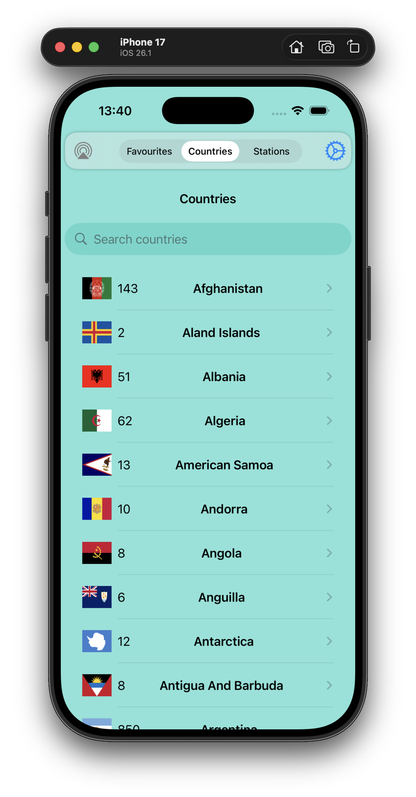

# MusicRadio

This is yet another radio stations player based on the [RadioBrowser](https://www.radio-browser.info/) and its server at [Community Radio Station Index](https://de1.api.radio-browser.info/#General).

This project uses SwiftUI and SwiftData to store the list of countries and the “Favourite” stations, but not all of the stations. 

Was meant to be a weekend project but ended up taking a week to polish.

  
   
   

