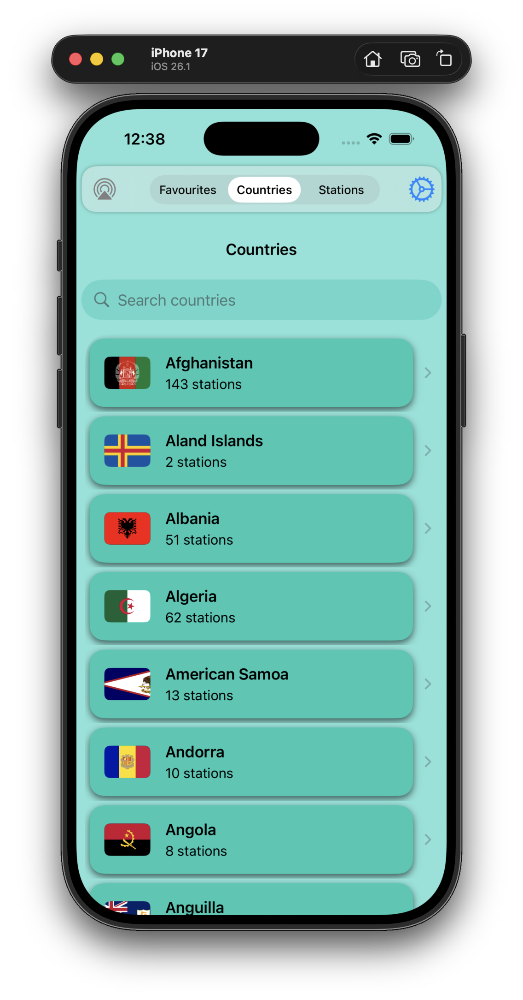

# MusicRadio

This is yet another radio stations player based on the [RadioBrowser](https://www.radio-browser.info/) and its server at [Community Radio Station Index](https://de1.api.radio-browser.info/#General).

This project uses SwiftUI and SwiftData to store only the list of countries and the *Favourites* stations. 

Was meant to be a weekend project but ended up taking a week to polish.

  
   
   

## Usage

Tap/click on the station you want to listen to, and it will appear 
in the **Play** bar at the bottom of the screen.

Search for the country you desire, then tap/click on the **heart** icon to 
make the station **Favourite**. That radio station will appear in the **Favourites** list.

Similarly, when you search for particular **Stations**.

Tap/click on the **globe** icon of a radio station to bring its internet home page, if it has one.

In the **Play** bar, while playing a song, or when a song title is shown, tap/click on the station radio icon to bring its iTunes artist info and the **lyrics** if available.

## Note     
The type of station displayed between the **heart** and the **globe** icons, 
is inferred based on the various tags the station wants to be known for.    
        

## References

### The radio stations

-    [RadioBrowser](https://www.radio-browser.info/) 
-    [adioBrowser API](https://docs.radio-browser.info/#introduction)
-    [Community Radio Station Index](https://de1.api.radio-browser.info/#General)

### The artists

-    [iTunes Search API](https://developer.apple.com/library/archive/documentation/AudioVideo/Conceptual/iTuneSearchAPI/UnderstandingSearchResults.html#//apple_ref/doc/uid/TP40017632-CH8-SW1)

### The lyrics

-    [LRCLIB](https://lrclib.net/) 

