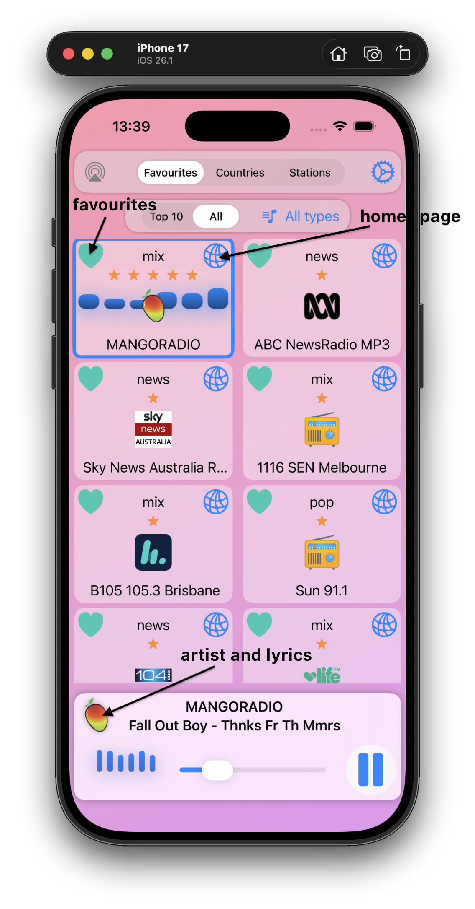
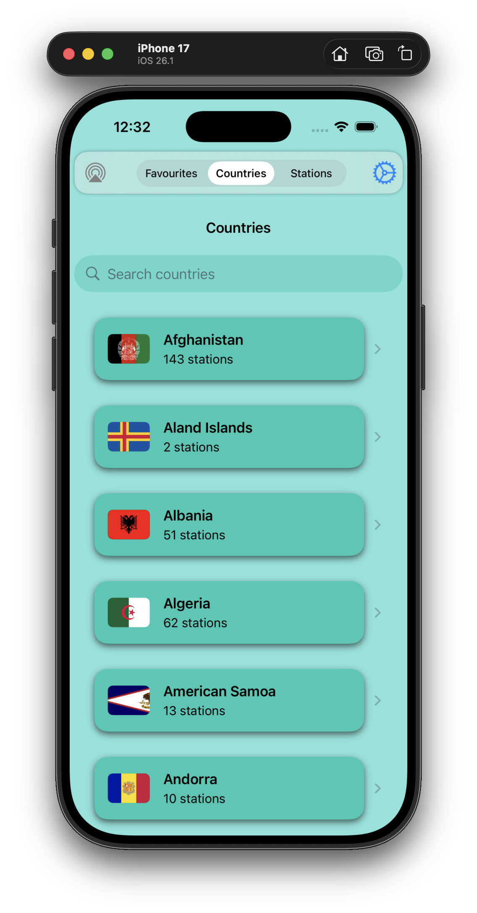
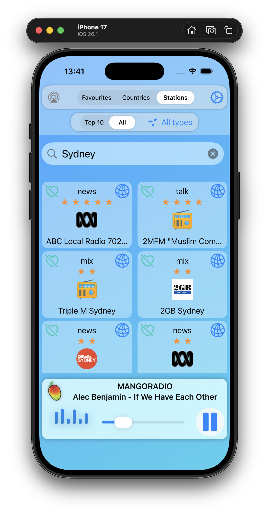

# MusicRadio

**MusicRadio** lets you play radio stations from the [RadioBrowser](https://www.radio-browser.info/) community project (over 50,000 stations). When a song is playing, it can also display the artist info and artwork retrieved from [iTunes](https://developer.apple.com/library/archive/documentation/AudioVideo/Conceptual/iTuneSearchAPI/index.html#//apple_ref/doc/uid/TP40017632-CH3-SW1).
In addition it can also display the **lyrics** of the current song from the community project [LRCLIB](https://lrclib.net/), when available. If the station is one of the rare **TV** station, you can also view its broadcast.

This is yet another radio stations player based on the [RadioBrowser](https://www.radio-browser.info/) and its server at [Community Radio Station Index](https://de1.api.radio-browser.info/#General). Was meant to be a weekend project but ended up taking a week to polish.

  
   
   

## Usage

Tap on the station you want to listen to, and it will appear 
in the **Play** bar at the bottom of the screen.

Search for the country you desire, then tap on the **heart** icon to 
make the station **Favourite**. That radio station will appear in the **Favourites** list.

Similarly, when you search for particular **Stations**.

Tap on the **globe** icon of a radio station to bring its internet home page, if it has one.

Tap on the **gear** icon to setup various settings. 

In the **Play** bar, while playing a song, or when a song title is shown, tap on the station radio icon to popup its iTunes artist info and the **lyrics** if available.

If the station is a **TV** station, a small TV icon will appear next to the *Play* button. Examples include *Bloomberg TV*, *ABC 11*, *Channel News Asia TV*, *Deutsche Welle TV*. Note that many of these channels may not broadcast consistently or may only stream intermittently.
Tap the **TV** station icon or the *Play* button to open the video, if it’s available.

## Note

This project uses SwiftUI and SwiftData to store only the list of countries and the *Favourites* stations. Currently setup for iOS-26, but can easily work on older iOS (remove the .glassEffect) or MacOS with simple changes.
     
The type/genre of station displayed between the **heart** and the **globe** icons, 
is inferred based on the various tags the station wants to be known for.    

## References

### The radio stations

-    [RadioBrowser](https://www.radio-browser.info/) 
-    [RadioBrowser API](https://docs.radio-browser.info/#introduction)
-    [Community Radio Station Index](https://de1.api.radio-browser.info/#General)

### The artists

-    [iTunes Search API](https://developer.apple.com/library/archive/documentation/AudioVideo/Conceptual/iTuneSearchAPI/index.html#//apple_ref/doc/uid/TP40017632-CH3-SW1)

### The lyrics

-    [LRCLIB](https://lrclib.net/) 

